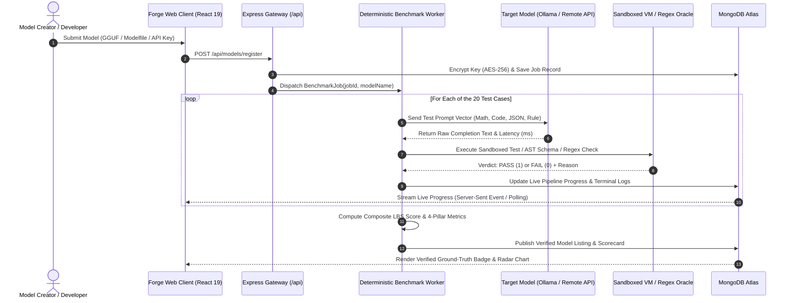

# 🧠 THEORETICAL FOUNDATIONS & ARCHITECTURAL FRAMEWORK OF FORGE MVP

> **A Rigorous Theoretical Framework for Zero-Bias, Deterministic Model Evaluation and Decentralized AI Marketplace Mechanism Design.**  
> *Author: Forge Core Engineering & Research Team*  
> *Version: 1.0 (LiveBench Deterministic Standard)*

---

## 📑 TABLE OF CONTENTS
1. [Epistemic Problem: The Breakdown of LLM Evaluation](#1-epistemic-problem-the-breakdown-of-llm-evaluation)
2. [Deterministic Oracle Verification Theory](#2-deterministic-oracle-verification-theory)
3. [The 4-Pillar Evaluation Framework](#3-the-4-pillar-evaluation-framework)
4. [Mathematical Formulation & Composite Scoring](#4-mathematical-formulation--composite-scoring)
5. [Pareto-Optimal Marketplace Mechanism Design](#5-pareto-optimal-marketplace-mechanism-design)
6. [Sandboxed VM Execution & Security Formalism](#6-sandboxed-vm-execution--security-formalism)
7. [Sub-100ms Inference & Low-Latency Retrieval Theory](#7-sub-100ms-inference--low-latency-retrieval-theory)
8. [Theoretical Architecture & Dataflow Diagram](#8-theoretical-architecture--dataflow-diagram)

---

## 1. EPISTEMIC PROBLEM: THE BREAKDOWN OF LLM EVALUATION

Modern Large Language Model (LLM) evaluations suffer from three catastrophic systemic failure modes:

### 1.1 Goodhart’s Law & Benchmark Contamination
$$\text{"When a measure becomes a target, it ceases to be a good measure."}$$
Static, web-scraped benchmark datasets (e.g., standard MMLU, GSM8K dumps) suffer from severe pre-training data contamination. Models inadvertently memorize token sequences rather than acquiring generalizable reasoning pathways.

### 1.2 "LLM-as-a-Judge" Stochastic Bias Matrix
Subjective evaluation pipelines that deploy frontier models (e.g., GPT-4) as evaluators suffer from well-documented cognitive distortions:
- **Self-Preference Bias**: Models systematically assign 5–15% higher subjective ratings to outputs generated by their own model family or training lineage.
- **Verbosity Bias**: Evaluator models disproportionately reward length, boilerplate politeness, and superficial structure over factual or programmatic accuracy.
- **Non-Deterministic Grading Drift**: Temperature-induced variance and non-reproducible seed states make benchmark scores fluctuate across identical evaluation runs.

---

## 2. DETERMINISTIC ORACLE VERIFICATION THEORY

Forge transitions AI evaluation from **stochastic LLM grading** to **deterministic oracle-bounded verification**.

### Core Epistemic Principles:
1. **Zero LLM Judge Bias**: No neural network is permitted to evaluate another neural network's correctness.
2. **Boolean Ground-Truth Oracles**: Every test case terminates in a strictly computable boolean verdict:
   $$\mathcal{V}(y, y^*) \in \{0, 1\}$$
   where $y$ is the raw model completion and $y^*$ is the formal ground-truth assertion vector.
3. **Hidden Unit Test Property Testing**: In code generation, correctness is defined strictly by input-output invariance across hidden test vectors executed in an isolated runtime sandbox.

---

## 3. THE 4-PILLAR EVALUATION FRAMEWORK

Forge categorizes model capability across four mathematically orthogonal domains:

```
                               ┌────────────────────────────────────────────────┐
                               │     FORGE 4-PILLAR DETERMINISTIC ENGINE        │
                               └──────────────────────┬─────────────────────────┘
                                                      │
         ┌────────────────────────┬───────────────────┴────────────────┬────────────────────────┐
         │                        │                                    │                        │
         ▼                        ▼                                    ▼                        ▼
┌──────────────────┐    ┌──────────────────┐                 ┌──────────────────┐    ┌──────────────────┐
│ 1. EXACT MATH &  │    │ 2. SANDBOXED VM  │                 │ 3. RIGID JSON    │    │ 4. LINGUISTIC    │
│    FORMAL LOGIC  │    │    CODE EXECUTION│                 │    SCHEMA AST    │    │    CONSTRAINTS   │
├──────────────────┤    ├──────────────────┤                 ├──────────────────┤    ├──────────────────┤
│ GSM8K Compound   │    │ Pure JS VM Sandbox│                │ AST Parser Invar.│    │ Zero-'e' Lipogram│
│ Modulo Arithmetic│    │ 3 Hidden Vectors │                 │ Key Type Bounds  │    │ Exact Word Count │
│ Number-Regex Map │    │ Mutation Bounds  │                 │ Structure Conform│    │ Token Delimiters │
└──────────────────┘    └──────────────────┘                 └──────────────────┘    └──────────────────┘
```

### Pillar 1: Mathematical & Formal Exactness ($\mathcal{P}_{\text{math}}$)
- **Methodology**: Evaluates multi-step arithmetic, combinatorics, modular arithmetic, and rate-time problems.
- **Verification Engine**: Multi-stage numeric extraction + isolated float/integer regex matching with strict $\epsilon$-tolerance:
  $$|N_{\text{extracted}} - N_{\text{expected}}| < 10^{-4}$$

### Pillar 2: Sandboxed VM Code Execution ($\mathcal{P}_{\text{code}}$)
- **Methodology**: Evaluates algorithmic synthesis (palindromes, deep object cloning, two-sum, stack validation).
- **Verification Engine**: The generated code string $C$ is sanitized and injected into an isolated Node.js `vm.Context` with restricted primitives (`timeout = 1000\text{ms}`). The function $f_C$ is invoked across $K$ hidden test tuples:
  $$\bigwedge_{k=1}^K \Big( f_C(\mathbf{x}_k) \equiv y_k \Big)$$

### Pillar 3: Structural JSON Schema & AST Invariance ($\mathcal{P}_{\text{schema}}$)
- **Methodology**: Evaluates unstructured-to-structured entity extraction from medical records, security logs, and financial tables.
- **Verification Engine**: Strict AST JSON parser with recursive type validation ensuring:
  $$\forall k \in \text{Keys}(S), \quad \text{typeof}(M[k]) \equiv \text{ExpectedType}(S[k]) \quad \land \quad M[k] \neq \text{undefined}$$

### Pillar 4: Linguistic Constraint Satisfaction ($\mathcal{P}_{\text{rule}}$)
- **Methodology**: Evaluates negative constraints, delimiter boundaries, and length invariance.
- **Verification Engine**:
  - *Lipogram Verification*: Letter-frequency boundary check ($\text{Count}(c \in \{\text{'e'}, \text{'E'}\}) = 0$).
  - *Exact Word Bound*: Tokenization split validator ($\text{Length}(\text{Words}(T)) = N$).
  - *Delimiter Integrity*: Formal grammar regex match (`/<<<Color>>>/`).

---

## 4. MATHEMATICAL FORMULATION & COMPOSITE SCORING

### 4.1 Category Pass Rate ($P_c$)
For any category $c \in \{\text{math}, \text{code}, \text{schema}, \text{rule}\}$ with $N_c$ test cases:
$$P_c = \left( \frac{1}{N_c} \sum_{i=1}^{N_c} \mathbb{I}(\text{Result}_i = \text{PASS}) \right) \times 100$$

### 4.2 Composite LiveBench Quality Score ($\text{LBS}$)
The unweighted arithmetic mean across all 4 deterministic pillars:
$$\text{LBS} = \frac{1}{4} \sum_{c=1}^4 P_c = \frac{P_{\text{math}} + P_{\text{code}} + P_{\text{schema}} + P_{\text{rule}}}{4}$$

---

## 5. PARETO-OPTIMAL MARKETPLACE MECHANISM DESIGN

In a real-world production environment, raw accuracy is insufficient. A model must be evaluated along the **Tri-Factor Pareto Efficiency Frontier**:

```
                              Accuracy / Quality (LBS %)
                                         ▲
                                         │       ★ Model A (Pareto Optimal)
                                         │      /  High Accuracy, Low Latency
                                         │     /
                                         │    /   ● Model B (Heavy Frontier)
                                         │   /    High Accuracy, High Cost
                                         │  /
                                         │ /  ▲ Model C (Niche Fast)
                                         │/   Low Accuracy, Ultra-Low Latency
                                         └─────────────────────────────►
                       Cost & Latency Efficiency  [1 / (TTFT × Price)]
```

### 5.1 Forge Efficiency Index ($\mathcal{E}_{\text{Forge}}$)
We formulate the unified deployment efficiency index $\mathcal{E}$ for any model $M$:

$$\mathcal{E}(M) = \frac{\text{LBS}(M)}{\log_{10}\big(\max(10, \mathcal{L}_{\text{TTFT}}(M))\big) \cdot \sqrt{1 + 1000 \cdot \mathcal{C}_{\text{token}}(M)}}$$

Where:
- $\text{LBS}(M) \in [0, 100]$ is the Composite Ground-Truth Quality Score.
- $\mathcal{L}_{\text{TTFT}}(M)$ is the Time-To-First-Token latency in milliseconds.
- $\mathcal{C}_{\text{token}}(M)$ is the creator's pricing per 1,000 tokens in USD.

### 5.2 Proof-of-Benchmark (PoB) Verification Seal
A model is only eligible for marketplace monetization and verified listing if:
$$\text{LBS}(M) \ge 70.0\% \quad \land \quad \text{CredentialStatus}(M) = \text{"verified"}$$

---

## 6. SANDBOXED VM EXECUTION & SECURITY FORMALISM

Executing arbitrary LLM-generated code presents security risks (remote code execution, memory exhaustion, infinite loops). Forge deploys an **Isolated Runtime Execution Boundary**:

```
┌─────────────────────────────────────────────────────────────┐
│                    NODE.JS HOST PROCESS                     │
│                                                             │
│   ┌─────────────────────────────────────────────────────┐   │
│   │           ISOLATED VM CONTEXT (SANDBOX)             │   │
│   │                                                     │   │
│   │  • Globals: nullified (no `process`, `fs`, `net`)  │   │
│   │  • Timeout: 1,000ms Hard Watchdog                  │   │
│   │  • Memory Limit: Constrained Scope Allocation       │   │
│   │  • Output: Value return or Exception capture        │   │
│   └─────────────────────────────────────────────────────┘   │
└─────────────────────────────────────────────────────────────┘
```

1. **Primitive Stripping**: Global references to `process`, `child_process`, `fs`, `net`, `http`, and `eval` are stripped from the sandbox prototype.
2. **Hard Timeout Watchdog**: `vm.runInContext(code, context, { timeout: 1000 })` terminates CPU-blocking infinite loops.
3. **AST Extraction**: Pre-processing extracts raw code from markdown code blocks before sandbox compilation.

---

## 7. SUB-100MS INFERENCE & LOW-LATENCY RETRIEVAL THEORY

The Forge Assistant uses an **Ultra-Low Latency Inference & Dynamic Context Injection Pipeline**:

### 7.1 Dynamic Context Grounding (Zero KV-Cache Pollution)
Rather than performing heavy vector database lookups for every chat interaction, Forge constructs a **Deterministic Real-Time Platform Snapshot**:
- Active marketplace listings, verified model scores, and creator handles are queried from MongoDB Atlas in $O(1)$ indexed reads.
- Grounding context is injected into the system prompt with strict token budgets ($\le 350$ tokens), preserving inference speed.

### 7.2 Multi-Engine Routing Matrix
- **LPU Specialized Inference (Groq Engine)**: Processes reasoning and general queries at **140–350 tokens/second** with Time-To-First-Token $\le 100\text{ms}$.
- **Native Vision & Code Inference (DeepSeek V4 / OpenCode)**: Handles complex programming, JSON schema formatting, and algorithmic queries.

---

## 8. THEORETICAL ARCHITECTURE & DATAFLOW DIAGRAM



---

## 9. CONCLUSION

Forge provides the mathematical and architectural blueprint for the future of decentralized, transparent AI model evaluation and distribution. By replacing subjective human or LLM judges with **objective deterministic ground-truth oracles**, Forge guarantees:
- **100% Reproducibility**
- **0% Evaluator Bias**
- **True Latency & Price-to-Performance Transparency**

---

*Document finalized and archived for the Forge Core Specification Repository.* ⚡
